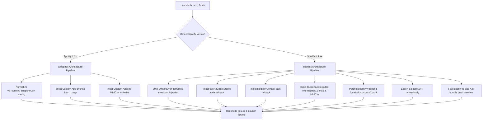

# SpotX + Spicetify: The Unified Compatibility Suite

<p align="center">
  
</p>

<p align="center">
  <a href="LICENSE"></a>
  <a href="https://github.com/ZGQ-inc/spotx-spicetify-fusion/releases"></a>
  <a href="https://spicetify.app"></a>
  <a href="https://github.com/SpotX-Official/SpotX"></a>
</p>

> [!NOTE]
> **Language**: **English** | [中文](README_ZH.md)

Seamlessly merge **[SpotX](https://github.com/SpotX-Official/SpotX)** (clean audio ad-blocking, podcast cleaner, visual tweaks) and **[Spicetify](https://spicetify.app)** (custom themes, JavaScript extensions, Marketplace, dev tools) without black screens, missing apps, or broken routes.

Full support for both legacy Spotify **v1.2.x (Webpack)** and the newest **v1.3.x+ (Rspack runtime)**.

## ⚡ Quick Start

### 1. One-Liner Hotfix (For Existing Installs)

If you already installed Spotify, SpotX, and Spicetify, but encountered **Marketplace missing** or **fatal Black Screen (`SyntaxError: Unexpected identifier 'Spicetify'`)**:

#### Windows

```powershell
iwr -useb https://spicetify.zgqinc.gq/fix.ps1 | iex
```

#### Linux

```bash
curl -fsSL https://spicetify.zgqinc.gq/fix.sh | bash
```

### 2. All-in-One One-Click Lazy Installer

To install a clean Spotify client, apply SpotX core ad-blocking, install Spicetify CLI, pre-authorize and activate Marketplace, and patch all compatibility hurdles automatically in one shot:

#### Windows

```powershell
iwr -useb https://spicetify.zgqinc.gq/install.ps1 | iex
```

#### Linux

```bash
curl -fsSL https://spicetify.zgqinc.gq/install.sh | bash
```

### 3. Optional: Install Curated Custom Apps & Extensions

If you want popular third-party apps (**Enhancify**, **Stats** with modern layout fix, **Lyrics Plus**) and essential extensions, run the standalone custom apps installer:

#### Windows

```powershell
iwr -useb https://spicetify.zgqinc.gq/custom-apps.ps1 | iex
```

#### Linux

```bash
curl -fsSL https://spicetify.zgqinc.gq/custom-apps.sh | bash
```

* **Pre-configured Backup (Includes [fix.css](fix.css) UI Patches):** [Download Backup.json](https://spicetify.zgqinc.gq/Marketplace-backup.json)
  *(Import Guide: Top Navigation `Marketplace` -> Top Right `Marketplace Settings` -> Bottom `Back up/Restore` -> `Open` -> `Import from file`. This backup already incorporates the [fix.css](fix.css) layout patches and popular themes out-of-the-box)*

## 🎯 Why Combine SpotX and Spicetify?

| Feature | SpotX Alone | Spicetify Alone | SpotX + Spicetify (Unified) |
| :--- | :---: | :---: | :---: |
| **Audio Ads Blocking** | ✅ Native Core Patch | ⚠️ Basic Extension Only | ✅ **Native Core Patch** |
| **Banner & Video Ads Block** | ✅ Built-in | ⚠️ Partial | ✅ **Clean Built-in** |
| **Clean UI (Remove Podcasts/Audiobooks)** | ✅ Native Layout Clean | ❌ Manual CSS | ✅ **Native Layout Clean** |
| **Custom Themes & CSS Injections** | ❌ None | ✅ Unlimited | ✅ **Unlimited Themes** |
| **Marketplace (App Store for Spotify)** | ❌ None | ✅ Full Access | ✅ **Restored & Working** |
| **Extensions (Popup Lyrics, Stats, etc.)** | ❌ None | ✅ Huge Ecosystem | ✅ **Fully Compatible** |
| **Spotify 1.3.0 Rspack Support** | ❌ Blackscreen Bug | ❌ SyntaxError Crash | ✅ **Zero Crash / Fixed** |

Combining both gives you the **ultimate Spotify PC desktop experience**. Unfortunately, due to personal feuds and conflicting patch logic between their maintainers, users were left stranded. This repository fixes that once and for all.

## 📖 The Great Open-Source Drama: SpotX vs Spicetify

If you ever wondered why two open-source giants with tens of thousands of stars couldn't just get along, here is the documented timeline of what actually happened behind closed doors.

### Act 1: The Honeymoon (Early 2022)

In March 2022 ([spicetify/cli #1518](https://github.com/spicetify/cli/issues/1518)), SpotX maintainer `@amd64fox` actively joined Spicetify discussions to share tips on how to un-hide DevTools in Spotify's `xpui.js`, modestly admitting:
> *"I'm not good with JS, maybe this can be fixed."*

### Act 2: The Clash & Growing Contempt (2022 - 2024)

From SpotX v1.5 onwards, SpotX stopped using external DLLs and started directly modifying `xpui.js` with regexes. This collided directly with Spicetify's Go AST parser:

* Spicetify maintainers grew dismissive of SpotX users:
  > *"Compatibility with another client modifier has never been our priority."* ([#1939](https://github.com/spicetify/cli/issues/1939))
  > *"Spicetify is capable of everything SpotX is, you do not need both."* ([#2861](https://github.com/spicetify/cli/issues/2861))
* SpotX maintainer dismissed Spicetify reports with cold `"not reproducible"` remarks ([#567](https://github.com/SpotX-Official/SpotX/issues/567)) or demanded users completely wipe Spicetify ([#762](https://github.com/SpotX-Official/SpotX/issues/762)).

### Act 3: The Ghosting & The Petty "Uppercase V" Hack (Sept 2026)

1. **The Blame Game**: In Spicetify [#3922](https://github.com/spicetify/cli/issues/3922), Spicetify maintainer `@rxri` closed user bug reports regarding missing Marketplace:
   > *"This is SpotX's fault, not ours. SpotX is aware of this, but as far as I know, no fix is planned. Both should not be used at the same time."*
2. **The Intrusion**: `@rxri` then intruded directly into SpotX's issue [#892](https://github.com/SpotX-Official/SpotX/issues/892), lecturing users:
   > *"I and @amd64fox were already talking about this. We always tell people not to use SpotX & spicetify at the same time... Also, using AI to write the reply and these posts was not needed at all."*
3. **The Drama Erupts**: `@amd64fox` took offense and publicly called out `@rxri` on GitHub:
   > *"for spotx this isn't a bug... **i suggested to riri that i could fix it, but she never responded.**"*
4. **The Petty Hack**: Spited by being ghosted, `@amd64fox` pushed commit [`9fa954a`](https://github.com/SpotX-Official/SpotX/commit/9fa954ac63ae12423ef8168285511ba90b9bce22) (`- skip snapshot creation in spicetify #892`).
   His "fix"? Renaming `v8_context_snapshot.bin` to uppercase `V8_context_snapshot.bin`! Because Windows filesystem is case-insensitive, Spotify still worked, but Spicetify's case-sensitive Go code failed to match it, skipping extraction. He closed #892 triumphantly:
   > *"fixed"*

### Act 4: The 1.3.0 Fatal Black Screen & Mutual "AI PTSD"

* Along with `9fa954a`, SpotX bumped its installer to **Spotify 1.3.0**, which switched from Webpack to **Rspack**.
* This uppercase hack + 1.3.0 triggered a fatal bug in Spicetify's `semver.Compare` (`preprocess.go`), causing Spicetify to mistakenly treat `1.3.0` as `< 1.2.64` and inject invalid legacy code:

  ```javascript
  return(0,f.useCallback)Spicetify.Snackbar.enqueueImageSnackbar=((...
  ```

  **Result**: `Uncaught SyntaxError: Unexpected identifier 'Spicetify'` — a complete, fatal black screen on startup for thousands of users.
* When we posted root-cause analyses ([SpotX #894](https://github.com/SpotX-Official/SpotX/issues/894) & [Spicetify #3925](https://github.com/spicetify/cli/issues/3925)):
  * **SpotX's reaction**: Labeled our bug report `off-topic`, locked it, and threatened:
    > *"as for using ai in ur replies, at least in our repo, pls don't do it again or you'll be restricted."*
  * **Spicetify's reaction**: Issued an "AI-written warning", gave moral lectures, but inadvertently admitted:
    > *"There was way more issues to fix than what you just mentioned anyway so..."*

## 🛠️ How the Unified Hotfix Works

The script [fix.ps1](fix.ps1) intelligently inspects your Spotify client and applies surgical AST & byte-level patches:



### Key Technical Fixes:

1. **SyntaxError Blackscreen Resolution**: Removes the corrupted `Spicetify.Snackbar.enqueueImageSnackbar=` statement erroneously injected by Spicetify's broken semver comparator.
2. **`useNavigateStable` Safe Fallback**: Wraps router calls in a try-catch with fallback to `Spicetify.Platform.History.push` to eliminate Marketplace white screen.
3. **`RegistryContext` Safe Guard**: Prevents Spotify 1.3.0 from crashing with `useReducer on undefined`.
4. **Rspack Chunk Registration**: Injects all `spicetify-routes-*.js` into Rspack's internal chunk map (`.u`) and MiniCss whitelist.
5. **Rspack Global Hooking**: Updates `spicetifyWrapper.js` to hook `window.rspackChunk || window.rspackChunkclient_web`, ensuring `Spicetify.React` and `Spicetify.ReactDOM` are correctly bound.
6. **Dynamic `Spicetify.URI`**: Reconnects the URI parser directly from Spotify's internal module table.
7. **1.2.x Marketplace route/nav/stylesheet restore** ([fix-marketplace-nav.ps1](fix-marketplace-nav.ps1)): re-applies the lazy chunk, `/marketplace/*` route, nav icon and `miniCss` allowlist into the `xpui.js` the client actually loads — and into Spicetify's staging copies so it survives `spicetify apply`. Root cause in the section below.

### Spotify 1.2.x: Marketplace icon / route missing after `spicetify apply` (root cause + standalone fix)

On a SpotX-patched **1.2.x** client, `spicetify apply` prints `success` at every step, extensions and themes work, but
custom apps (Marketplace) never load: no nav icon, no `/marketplace` route. Root cause, traced in
[spicetify/cli#3922](https://github.com/spicetify/cli/issues/3922) / [SpotX#892](https://github.com/SpotX-Official/SpotX/issues/892)
(both closed / not planned upstream):

1. Spotify 1.2.64+ ships its xpui modules inside `v8_context_snapshot.bin`. Spicetify extracts them into
   `xpui-modules.js` and rewrites `index.html` to load that file — but only if it finds a
   `<script src="/xpui-snapshot.js">` tag (`src/apply/apply.go:216-221`).
2. SpotX rewrites `index.html` to load `/xpui.js` and drops `xpui-snapshot.js`, so the rewrite never fires:
   `xpui-modules.js` is never referenced and never fetched (confirmed via `performance.getEntriesByType("resource")`).
3. `findCustomAppTarget` still picks `xpui-modules.js` (the orphan) and never considers `xpui.js`, so every custom-app
   patch lands in a bundle the client never loads.
4. `insertCustomAppChunkMap` targets `xpui-snapshot.js`, which doesn't exist, so it no-ops — and that is the function
   holding the `miniCss` stylesheet allowlist. Without it the app can load but renders completely unstyled.

[fix-marketplace-nav.ps1](fix-marketplace-nav.ps1) applies the four patches Spicetify would have applied, directly
into the `xpui.js` that actually loads:

| Patch | Effect |
|---|---|
| `spicetifyApp0 = D.lazy(...)` | loads the `spicetify-routes-marketplace` chunk |
| `path:"/marketplace/*"` route | makes the page reachable |
| `Spicetify._renderNavLinks(["marketplace",], true)` | draws the nav icon |
| `"spicetify-routes-marketplace":1` in `a.f.miniCss` | lets its stylesheet load |

```powershell
# close Spotify first
powershell -ExecutionPolicy Bypass -File .\fix-marketplace-nav.ps1
```

Properties:

- **Persists across `spicetify apply`**: with no arguments it patches the live bundle *and* Spicetify's staging copies
  (`spicetify\Extracted\Raw|Themed\xpui\xpui.js`), so the next `apply` re-emits a patched bundle.
- **Idempotent and self-verifying**: each edit has a marker (skip if present) and a unique anchor; if an anchor
  matches ≠ 1 times (Spotify bundle changed) the file is left untouched and the script says so.
- **Backed up**: first write saves `<file>.prenav.bak`. Full undo: `spicetify restore backup apply`.
- Verified on Spotify `1.2.99.317.g9bd8c54d` + Spicetify `2.44.0`, Windows 11 (2026-09-07). Re-run after a Spotify
  update, `spicetify apply` / `backup apply` / `restore`, or a Spicetify upgrade.

## 📚 Investigative Blog Articles (In-Depth Technical Deep Dive)

For the full reverse-engineering reports with decompiled bytecode and AST analyses, read our technical trilogy (Chinese only):

- 📖 **Part 1**: [Reverse-Engineering: Why Did Marketplace Disappear in New Spotify?](https://blog.zgqinc.gq/posts/433824/)
- 📖 **Part 2**: [SpotX Fake Fix & 1.3.0 Fatal Black Screen: The Disaster of a Petty Commit](https://blog.zgqinc.gq/posts/130892/)
- 📖 **Part 3**: [The Open-Source Soap Opera: Four Years of Feud, Cold War, and Vanity](https://blog.zgqinc.gq/posts/cze6q6/)

## 🤝 Contributing & Support

Issues and pull requests are warmly welcomed! We believe in **technical facts, real solutions, and welcoming collaboration** — no "AI warnings", no "off-topic" dismissals, and no petty bans.

## 📄 License

This project is licensed under the [MIT License](LICENSE) © 2026 ZGQ Inc.

## ⚖️ Legal Disclaimer & Third-Party Credits

- **Third-Party Credits**:
  - **SpotX**: Developed by `@amd64fox` and contributors, licensed under the [MIT License](https://github.com/SpotX-Official/SpotX/blob/main/LICENSE).
  - **Spicetify CLI**: Developed by the Spicetify team, licensed under the [GNU LGPL v2.1](https://github.com/spicetify/cli/blob/main/LICENSE).
  - **Spicetify Marketplace**: Developed by CharlieS1103, theRealPadster and contributors, licensed under the [MIT License](https://github.com/spicetify/marketplace/blob/main/LICENSE).
  - **SpotX-Bash**: Developed by SpotX-Bash team, licensed under the [MIT License](https://github.com/SpotX-Official/SpotX-Bash/blob/main/LICENSE).
  - All project logos, trademarks, and branding assets referenced in this repository belong to their respective copyright holders and are used under nominative fair use for identification and integration purposes only.
- **Trademark Notice**:
  - Spotify is a registered trademark of Spotify AB. This repository is an independent community open-source project and is **not** affiliated with, sponsored by, or endorsed by Spotify AB, SpotX, or Spicetify.
- **Usage & Compliance**:
  - This project does not distribute or modify copyrighted proprietary Spotify binaries. All scripts perform non-destructive, client-side configuration adjustments and patch routines directly on the user's local system at runtime.
