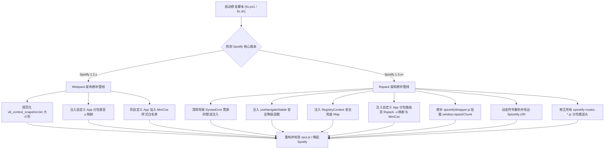

# SpotX + Spicetify 终极全自动兼容套件

<p align="center">
  
</p>

<p align="center">
  <a href="LICENSE"></a>
  <a href="https://github.com/ZGQ-inc/spotx-spicetify-fusion/releases"></a>
  <a href="https://spicetify.app"></a>
  <a href="https://github.com/SpotX-Official/SpotX"></a>
</p>

> [!NOTE]
> **语言**：**中文** | [English](README.md)

让 **[SpotX](https://github.com/SpotX-Official/SpotX)**（纯净无广告、干掉播客与有声书、音质与布局优化）与 **[Spicetify](https://spicetify.app)**（海量主题定制、JS 扩展、Marketplace 应用商店、开发者生态）实现无缝共存！

告别黑屏、告别白屏崩溃、告别应用商店失踪。全面兼容 Spotify 老版本 **v1.2.x (Webpack)** 与全新架构 **v1.3.x+ (Rspack 运行时)**。

## ⚡ 极速开始（一行命令）

### 1. 存量环境极速热修复（针对已有安装）

如果你已经安装了 Spotify、SpotX 和 Spicetify，但遇到了 **Marketplace 按钮消失**、或者升级到最新版后 **直接致命黑屏（`SyntaxError: Unexpected identifier 'Spicetify'`）**：

#### Windows

```powershell
iwr -useb https://spicetify.zgqinc.gq/fix.ps1 | iex
```

#### Linux

```bash
curl -fsSL https://spicetify.zgqinc.gq/fix.sh | bash
```

### 2. 懒人一条龙一键全自动安装

全新环境一键搞定：全自动下载安装 Spotify、配置 SpotX 核心去广告、部署 Spicetify CLI、预授权并激活 Marketplace 官方应用市场，全自动应用双版本兼容器统一 Hotfix：

#### Windows

```powershell
iwr -useb https://spicetify.zgqinc.gq/install.ps1 | iex
```

#### Linux

```bash
curl -fsSL https://spicetify.zgqinc.gq/install.sh | bash
```

### 3. 可选：一键安装精选自定义应用与拓展 (Custom Apps & Extensions)

若需要额外安装精选的第三方独立应用（如 **Enhancify** 增强面板、**Stats** 修复版听歌统计、**Lyrics Plus** 桌面歌词及各类快捷键拓展），运行独立拓展安装脚本即可：

#### Windows

```powershell
iwr -useb https://spicetify.zgqinc.gq/custom-apps.ps1 | iex
```

#### Linux

```bash
curl -fsSL https://spicetify.zgqinc.gq/custom-apps.sh | bash
```

## 🎯 为什么要同时使用 SpotX 和 Spicetify？

| 功能特性 | 仅装 SpotX | 仅装 Spicetify | SpotX + Spicetify（强强联手） |
| :--- | :---: | :---: | :---: |
| **音频插播广告拦截** | ✅ 原生二进制强力切断 | ⚠️ 依赖简单拓展易失效 | ✅ **原生二进制彻底静音跳过** |
| **横幅、视频与视觉广告** | ✅ 原生屏蔽干净 | ⚠️ 偶尔有残留 | ✅ **最强双重纯净** |
| **去播客与有声书（纯音乐化）** | ✅ 原生直接隐藏 | ❌ 需手工写复杂 CSS | ✅ **开箱即用纯净音乐库** |
| **自定义 CSS / 主题美化** | ❌ 完全不支持 | ✅ 支持海量主题 | ✅ **随心所欲换肤** |
| **Marketplace 应用市场** | ❌ 无 | ✅ 原生支持 | ✅ **修复完好，正常浏览下载** |
| **各类高级插件（歌词、统计等）** | ❌ 无 | ✅ 生态繁荣 | ✅ **全部正常运作** |
| **Spotify 1.3.0 Rspack 兼容** | ❌ 假修复导致黑屏 | ❌ 版本判断 Bug 崩溃 | ✅ **全网首发完美运行，零黑屏** |

二者结合是 PC 端享受 Spotify 最完美的形态。然而长期以来，由于两边维护者的个人恩怨与互相排斥，用户不仅无法得到官方支持，甚至沦为互相踢皮球的受害者。本项目从根本上终结了这一乱象。

## 📖 开源抓马大赏：SpotX 与 Spicetify 的四年恩怨录

很多人好奇，为什么两个在 GitHub 上拥有数万 Star 的顶流项目，宁可看着全网用户黑屏，也不愿意给对方做一行兼容？深挖 Issues 与提交历史，还原这场令人啼笑皆非的开源抓马：

### 第一幕：昔日情谊（2022 年初）

2022 年 3 月（[spicetify/cli #1518](https://github.com/spicetify/cli/issues/1518)），SpotX 的作者 `@amd64fox` 甚至在 Spicetify 社区虚心求教如何开启 DevTools 控制台，并谦逊留言：
> *"I'm not good with JS, maybe this can be fixed."*（我对 JS 不太熟，也许这能修好。）

### 第二幕：代码互撞与官方傲慢（2022 - 2024 年）

从 SpotX v1.5 开始，`amd64fox` 不再单纯用外部 DLL 劫持，而是开始直接硬编码正则去改 `xpui.js`。这直接摧毁了 Spicetify 的 AST 语法树解析器，两边从此结下梁子：

* Spicetify 维护者在多个 Issue 中明确鄙视 SpotX：
  > *"兼容其他修改器从来不是我们的优先级。"*（[#1939](https://github.com/spicetify/cli/issues/1939)）
  > *"Spicetify 能做 SpotX 的一切，你们根本不需要 SpotX。"*（[#2861](https://github.com/spicetify/cli/issues/2861)）
* SpotX 这边同样敷衍，用户反映插件冲突，作者冷冷一句 `"not reproducible"`（[#567](https://github.com/SpotX-Official/SpotX/issues/567)）或者甩出卸载脚本让用户全删。

### 第三幕：已读不回与赌气式“大写 V”假修复（2026 年 9 月）

1. **甩锅踢皮球**：9 月初，用户反馈 Marketplace 丢失（[#3922](https://github.com/spicetify/cli/issues/3922)），Spicetify 核心成员 `@rxri` 秒关贴并甩锅：
   > *"这是 SpotX 的错，SpotX 知道这事但不打算修，两边不该一起用。"*
2. **跨库巡检**：`@rxri` 随后亲自跑到 SpotX 的 [#892](https://github.com/SpotX-Official/SpotX/issues/892) 训诫用户：
   > *"我和 @amd64fox 早就聊过这事了……另外发帖用 AI 根本没必要。"*
3. **当场掀桌**：`@amd64fox` 自尊心被戳爆，公开曝光对方冷暴力：
   > *"这对我来说不是 bug……**我之前跟 riri 提议过我可以修，但她从来就没回复过我（she never responded）！**"*
4. **赌气假修复**：被“已读不回”彻底搞破防的 `amd64fox`，在 24 小时内推送了提交 [`9fa954a`](https://github.com/SpotX-Official/SpotX/commit/9fa954ac63ae12423ef8168285511ba90b9bce22)。
   他的“神操作”是：**把 `v8_context_snapshot.bin` 偷偷改名为大写的 `V8_context_snapshot.bin`**！利用 Windows 不区分大小写让客户端能跑，但欺骗 Spicetify 区分大小写的 Go 正则，使其匹配失败跳过解包！搞完后极其傲慢地在 #892 回复了两个字母关贴：
   > *"fixed"*

### 第四幕：全网黑屏与集体患上的“AI PTSD”

* 赌气提完大写 `V`，SpotX 顺带手把安装器拉升到了 **Spotify 1.3.0**（底层打包器换成 Rspack）。
* 恶搞代码引爆连锁反应：Spicetify 的 `semver.Compare` 出现低级 Bug，误把 `1.3.0` 识别成比 `1.2.64` 还老的远古版本，强行注入了早已废弃的语法：

  ```javascript
  return(0,f.useCallback)Spicetify.Snackbar.enqueueImageSnackbar=((...
  ```

  **直接导致运行时报致命错误：`Uncaught SyntaxError: Unexpected identifier 'Spicetify'`，全球用户只要升级启动全部死机黑屏！**
* 当我们在 [#894](https://github.com/SpotX-Official/SpotX/issues/894) 和 [#3925](https://github.com/spicetify/cli/issues/3925) 贴出严密的逆向证明和修复方案时：
  * **SpotX 的反应**：气急败坏把 Issue 打成 `off-topic`，并威胁封号：
    > *"在我们的仓库别再用 AI，否则你会被限制账号（restricted）。"*
  * **Spicetify 的反应**：给用户发“AI 警告”，大谈“大家都是人类”，但不得不暗搓搓承认：
    > *"反正要修的问题远比你提到的多得多，所以……（way more issues to fix anyway so...）"*

## 🛠️ 统一兼容补丁技术原理

统一脚本 [fix.ps1](fix.ps1) / [fix.sh](fix.sh) 会在本地自动检测当前客户端版本与打包架构，并执行精细化 AST 与二进制级别重构：



### 核心技术细节：

1. **解决 1.3.0 启动致命黑屏**：清除 Spicetify 错判版本注入的非法语法块 `badSnackbar`，解除 V8 引擎解析死锁。
2. **解决 Marketplace 白屏崩溃**：将裸调用的 `useNavigateStable` 包装进安全降级闭包，降级回退至 `Spicetify.Platform.History.push`。
3. **解决 RegistryContext 弹窗报错**：为 Spotify 1.3.0 全新的注册表上下文注入 `{entries:new Map()}` 安全兜底，杜绝 `useReducer on undefined`。
4. **适配 Rspack 分包加载链**：自动扫描并为所有 `spicetify-routes-*.js` 生成分包表，分别注入到 Rspack 内部的 `.u` 定位器与 `MiniCss` 样式白名单。
5. **挂载 Rspack 全局运行时**：修补 `spicetifyWrapper.js`，兼容 `window.rspackChunk`，确保 `Spicetify.React` 与 `Spicetify.ReactDOM` 正常绑定。
6. **动态接入 Spicetify.URI**：通过解析内部符号表动态导出 URI 解析构造器。
7. **平替与标准化快照命名**：将 SpotX 恶意修改的大写 `V8_context_snapshot.bin` 恢复标准小写，保障 1.2.x 存量逻辑不受干扰。

## 📚 逆向工程系列文章与参考

完整的汇编分析、AST 对比与逆向过程详见博客三部曲：

- 📖 **第一篇**：[《逆向排查：Spotify 新版中 Spicetify 失去自定义应用（Marketplace）的原因为何？》](https://blog.zgqinc.gq/posts/433824/)
- 📖 **第二篇**：[《SpotX 假修复与 1.3.0 致命黑屏：一次赌气提交引发的灾难》](https://blog.zgqinc.gq/posts/130892/)
- 📖 **第三篇**：[《开源抓马大赏：SpotX 与 Spicetify 的四年恩怨录与黑屏闹剧》](https://blog.zgqinc.gq/posts/cze6q6/)

## 🤝 贡献与交流

欢迎提交 Issue 和 Pull Request！我们坚信 **“事实胜于雄辩，代码胜于私怨”** —— 这里没有莫名其妙的 AI 警告，没有仗势欺人的封号威胁，只有真正解决问题的极客精神。

## 📄 开源许可证

本项目基于 [MIT License](LICENSE) 开源 © 2026 ZGQ Inc.

## ⚖️ 法律免责声明与第三方版权鸣谢

- **第三方项目授权与鸣谢**：
  - **SpotX**：由 `@amd64fox` 及其贡献者开发维护，基于 [MIT 许可证](https://github.com/SpotX-Official/SpotX/blob/main/LICENSE) 开源。
  - **Spicetify CLI**：由 Spicetify 团队开发维护，核心程序基于 [GNU LGPL v2.1 许可证](https://github.com/spicetify/cli/blob/main/LICENSE) 开源。
  - **Spicetify Marketplace**：由 CharlieS1103、theRealPadster 及其贡献者开发，基于 [MIT 许可证](https://github.com/spicetify/marketplace/blob/main/LICENSE) 开源。
  - **SpotX-Bash**：由 SpotX-Bash 团队维护，基于 [MIT 许可证](https://github.com/SpotX-Official/SpotX-Bash/blob/main/LICENSE) 开源。
  - 本项目所引用的项目 Logo、商标及品牌标识，其著作权与所有权均归原作者及项目所属组织所有，引用仅出于指示性合理使用（Nominative Fair Use）及兼容性标识之目的。
- **商标声明**：
  - Spotify® 是 Spotify AB 的注册商标。本项目为独立的开源社区兼容方案，与 Spotify AB、SpotX 团队或 Spicetify 团队不存在任何从属、赞助或官方背书关系。
- **合规性与使用说明**：
  - 本仓库本身不打包、不分发任何受版权保护的 Spotify 专有闭源程序。所有脚本均仅在用户本地计算机上对已安装的文件执行客户端配置与兼容性逻辑修正。
